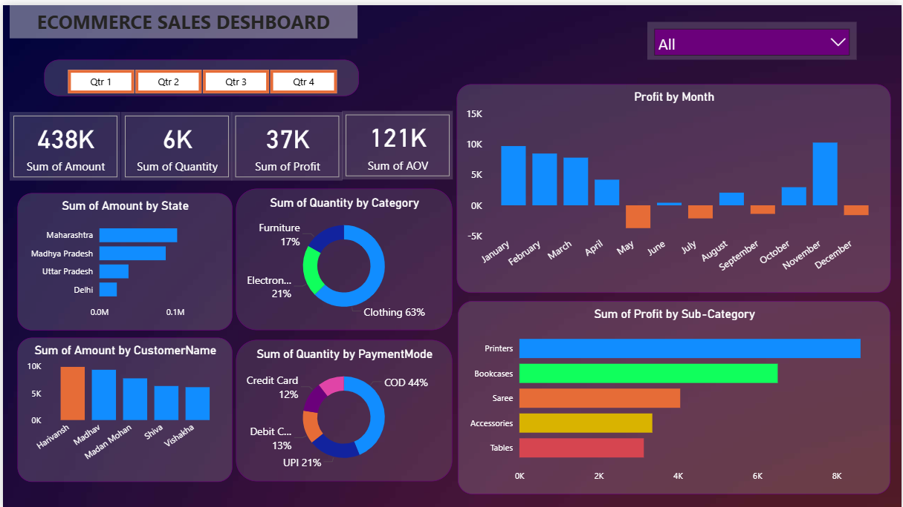

# Data-Analysis-Dashboard-for-Sales
E-Commerce Sales Dashboard in Power BI delivering actionable insights into sales, profit, and customer trends. Tracks KPIs such as total revenue, profit margin, and average order value, with breakdowns by state, category, payment mode, and customer segment to support strategic business decisions.

# E-Commerce Sales Dashboard

## Project Overview
This project showcases an **E-Commerce Sales Dashboard** built using Power BI to track and analyze sales performance across multiple states, product categories, and payment modes.  
The dashboard provides a clear view of revenue, profit trends, customer insights, and product performance, enabling business stakeholders to make data-driven decisions.

---

## Key Insights & Metrics
- **Total Sales Amount:** 438K  
- **Total Quantity Sold:** 6K  
- **Total Profit:** 37K  
- **Average Order Value (AOV):** 121K  

### Sales Analysis
- **By State:** Maharashtra, Madhya Pradesh, Uttar Pradesh, Delhi, etc.  
- **By Category:** Clothing, Electronics, Furniture  
- **By Sub-Category:** Printers, Bookcases, Saree, Accessories, Tables  
- **By Payment Mode:** COD, UPI, Debit Card, Credit Card  
- **By Customer:** Top customers and their purchase amounts  

### Profit Analysis
- **Profit by Month:** Identifies seasonal trends and high/low performing months  
- **Profit by Sub-Category:** Highlights the most and least profitable product lines  

---

## Dashboard Preview

---

## Purpose
- Track **sales performance** and **profitability** over time.  
- Identify top-performing **states, customers, and product categories**.  
- Optimize **payment mode strategies** based on sales data.  
- Enable faster, **data-driven decision-making** for business growth.  

---

## Tools & Technologies
- **Power BI** – Data visualization & dashboard creation  
- **Excel / CSV** – Data source  
- **Power Query** – Data cleaning & transformation  
- **DAX** – Calculated measures for KPIs  

---

## Outcome
The E-Commerce Sales Dashboard provides:
- Better understanding of **sales trends and patterns**.
- Insights to **improve product strategy and marketing focus**.
- Clear visualization of **seasonal and regional performance**.
- Support for **increasing profitability** and **enhancing customer engagement**.

